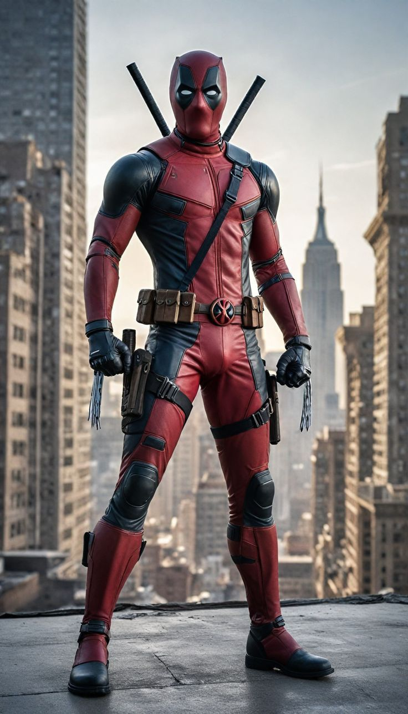
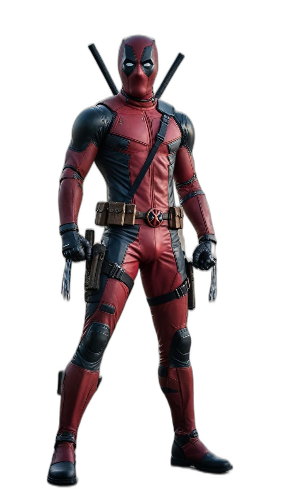
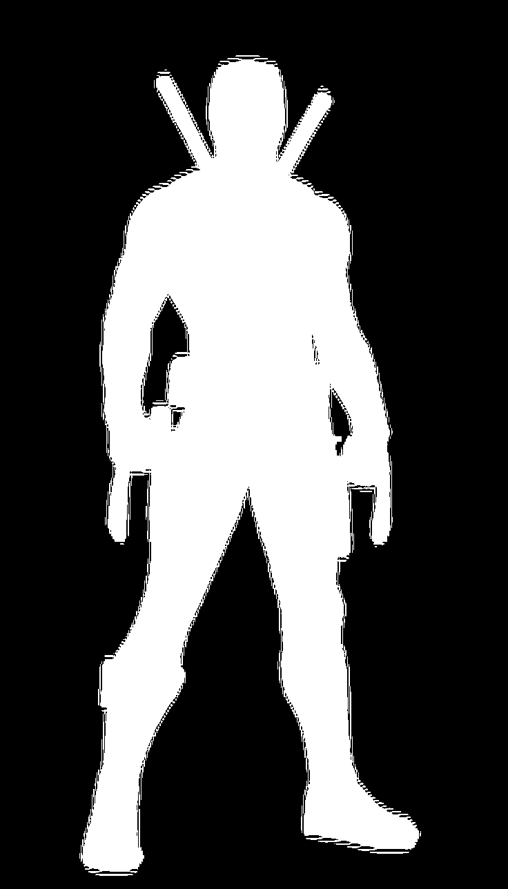
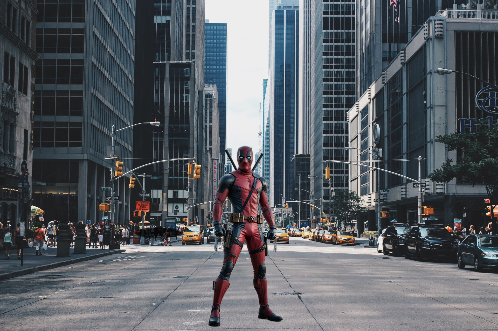

# Blend
## Pipeline Steps

| Step | Image |
|------|-------|
| Foreground with background |  |
| Background Removed |  |
| Binary Mask |  |
| Background Scene |  |
| Composite (with shadow blending)|  |

## How It Works
1. **Background Removal**

    The foreground image (with its original background) is processed using rembg, which automatically removes the background.

    The result is a transparent cutout of the object, along with an alpha mask that defines the object's shape.

 2. **Mask Extraction**

    From the cutout, a binary mask is generated.

    This mask is essential for guiding blending and harmonization steps.

 3. **Vanishing Point Estimation for Foreground Placement**
    
     

    Before compositing, the vanishing point or scene perspective of the background image is analyzed to determine the correct scale and placement of the foreground object.
   
    By aligning the foreground with the background’s perspective lines, then the character is placed in a geometrically according to the lines
   
 4. **Image Blending**

    After harmonization, the foreground is blended into the background using advanced image blending techniques like Poisson blending and alpha blending.

    This ensures the edges of the object transition smoothly into the background without visible seams or artifacts.

